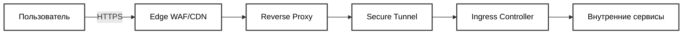

# PetProject — персональный планировщик питания и недельного меню

TL;DR: Приложение помогает за минуты составить недельное меню из имеющихся ингредиентов, следить за КБЖУ и планировать закупки.
Репозиторий — публичный паспорт проекта (без исходников). Issues/PR по исходному коду не принимаются.

---

## Содержание
- [Кратко о проекте](#кратко-о-проекте)
- [Ключевые возможности](#ключевые-возможности)
- [Продукт и дизайн](#продукт-и-дизайн)
- [MVP-экраны](#mvp-экраны)
- [Входящий трафик и периметр безопасности](#входящий-трафик-и-периметр-безопасности)
- [Высокоуровневая архитектура](#высокоуровневая-архитектура)
- [Среды и окружения](#среды-и-окружения)
- [API и документация](#api-и-документация)
- [Запуск и взаимодействие](#запуск-и-взаимодействие)
- [Быстрый старт (локально)](#быстрый-старт-локально)
- [Ранбук (прод)](#ранбук-прод)
- [Фронтенд (iOS)](#фронтенд-ios)
- [Инфраструктура, CI/CD и секреты](#инфраструктура-ci-cd-и-секреты)
- [Компоненты кластера](#компоненты-кластера)
- [Наблюдаемость и эксплуатация](#наблюдаемость-и-эксплуатация)
- [Резервные копии](#резервные-копии)
- [Дорожная карта](#дорожная-карта)
- [FAQ](#faq)
- [Как участвовать](#как-участвовать)
- [Лицензия](#лицензия)
- [Контакты](#контакты)
- [Для рекрутеров и техлидов](#для-рекрутеров-и-техлидов)
- [Политика раскрытия и доступа](#политика-раскрытия-и-доступа)

---

## Кратко о проекте
PetProject — это персональный планировщик питания, который за минуты составляет недельное меню из ингредиентов, которые уже есть у пользователя. Приложение убирает рутину «что приготовить» и помогает держать под контролем КБЖУ через виджеты и расписание.

Статус: активно развивается. Публичный роадмап и демо появятся позже (см. раздел «Дорожная карта»).

## Ключевые возможности
- Конструктор меню: выбор имеющихся ингредиентов + фильтры → список блюд
- Планировщик недели с редактированием и разнообразием
- Виджеты и графики КБЖУ (факт vs план) на день/неделю

## Продукт и дизайн
- Целевая аудитория: молодые пользователи с разным кулинарным опытом, кому важно не тратить время на выбор блюд и держать рацион под контролем.
- Тон бренда: удобный и продуманный, минимизация лишних действий.
- Палитра: зелёные оттенки, ассоциации со здоровым питанием.
- Логотип: есть базовый логотип (возможны дальнейшие варианты).
- Эмоции: ощущение контроля над рационом и экономия времени.
- Навигация: Tab Bar; поиск рецептов — отдельный экран/flow.
- Онбординг: обучение составлению расписания и работе с экраном ингредиентов.
- Тёмная тема: не обязательна.
- iPad: поддержка планируется.
- Пустые состояния: предусмотрены (например, «список покупок пуст»).
- Референсы (UX): «Food», «Яндекс Еда», «ВкусВилл» — используем лучшие практики, избегаем перегруза интерфейса.

## MVP-экраны
- Главный экран: виджеты/графики КБЖУ и карточки ближайших блюд, динамически по времени дня (например, обед).
- Лента рецептов.
- Планировщик недели.
- Список покупок.
- Профиль.

## Входящий трафик и периметр безопасности
Ниже — санитизированная схема пути входящего трафика. Она не раскрывает внутренних сетевых диапазонов, имён хостов и конфигураций брандмауэров.

Ключевые моменты:
- Edge WAF/CDN (облачный провайдер) выполняет внешнюю фильтрацию/кеширование.
- На edge — реверс‑прокси; далее защищённый туннель до входа в кластер.
- В кластере — Ingress Controller с маршрутизацией к сервисам.
- Точки терминации TLS и протоколы не раскрываются публично.

## Высокоуровневая архитектура
Компоненты (упрощённо):
- Периметр: Edge WAF/CDN (облачный провайдер)
- Edge: реверс‑прокси
- Туннель: защищённый канал до кластера
- Ingress: контроллер маршрутизации
- Сервисы: приложения и API в Kubernetes
- Хранилища: реляционная БД, векторное хранилище, кеши

Принципы:
- Безопасность по умолчанию (least privilege, секреты вне репозитория, защита трассировки)
- Наблюдаемость как продуктовая функция (метрики, логи, трассировки)
- Автоматизация (CI/CD, декларативные манифесты)

## Среды и окружения
- Development: локальная разработка и валидация изменений
- Staging: предпродакшн тестирование
- Production: боевая среда

Подробности (домены, политики доступа) сознательно опущены в публичной документации.

## API и документация
- Спецификация: OpenAPI 3.0.0, версия API 1.5.0 (YAML). Публичная Swagger‑ссылка появится позже; server base URL скрыт до релиза.
- Схема безопасности в спецификации: Bearer токен (JWT). Аутентификация через OAuth2/OIDC (Keycloak).
- Основные ресурсы: Auth (/auth/status, /auth/logout, /auth/userinfo), Users (/users/{id}), Recipes (/recipes, /recipes/{id}), Images (/images, /images/{id}), Ingredients (/ingredients, /ingredients/{id}).
- Rate limiting: на периметре (Edge WAF/CDN).

## Запуск и взаимодействие
Так как код приватный, здесь даётся только высокоуровневый сценарий:
1) Локально: multipass + k3s для поднятия зависимостей
2) Кластер: декларативные манифесты/helm чарты (подтверждается)
3) Пайплайн: CI/CD прогоняет тесты, линтеры, сборку артефактов и деплой

Полные инструкции будут опубликованы после подготовки безопасного публичного шаблона.

## Быстрый старт (локально)
Этот раздел намеренно описывает только высокоуровневые требования, не предполагая передачу исходного кода.
- Требования: современная среда разработки iOS (Xcode с iOS 18 SDK) и доступ к закрытому API (предоставляется по запросу/NDA).
- Публичные зависимости: DataHandler как отдельная open-source библиотека для SwiftData — [github.com/kirilltitov1/DataHandler](https://github.com/kirilltitov1/DataHandler). Интеграция клиента и настройки выполняются в приватном репозитории.
- Детальные инструкции по сборке/запуску, конфигурация окружений и любые скрипты поставляются отдельно и не публикуются.

## Ранбук (прод)
Публичная версия runbook не содержит операционных деталей. Доступна только демо‑сессия:
- Демонстрация функциональности и UX — по запросу.
- Тестовый доступ и сценарии — предоставляются на время демо, без раскрытия инфраструктуры и конфигураций.
- Технические вопросы (архитектура, SLO, безопасность) обсуждаем на звонке. Детальная документация — под NDA.

## Фронтенд (iOS)
- Target: iOS 18.0
- Стек UI: SwiftUI + UIKit (где уместно)
- Данные: SwiftData, обёртка для CRUD — собственная библиотека DataHandler ([репозиторий](https://github.com/kirilltitov1/DataHandler))
- Конкурентность: Swift Concurrency (async/await, @MainActor)
- Логирование: SwiftyBeaver
- Архитектура клиента: MVVM, экран «Главная» с виджетами КБЖУ и карточками ближайших блюд, отдельные экраны «Лента рецептов», «Планировщик недели», «Список покупок», «Профиль»; онбординг по расписанию и ингредиентам.

## Инфраструктура, CI/CD и секреты
- Orchestrator: k3s (приватный кластер)
- Packaging: Helm charts
- Ingress: Traefik (строгая экспозиция сервисов)
- Периметр: Edge WAF/CDN (облачный провайдер)
- CI/CD: в разработке
- Секреты: декларативный подход, инструмент будет уточнён (без хранения в гите в открытом виде)
- Контейнерные образы: приватный реестр, сканирование уязвимостей планируется

### Автоматизация и Workflow
- Используется Cursor Memory Bank для решения типовых задач (быстрые фиксы/документация/рутинные улучшения) с контролем качества через ревью.

## Компоненты кластера
Состав (k3s, Helm):
- server — Vapor (Swift) сервер API
- cert-manager — управление сертификатами
- keycloak — система аутентификации и авторизации (OAuth2/OIDC)
- master — системные компоненты/утилиты управления
- n8n — автоматизация и интеграционные сценарии
- postgres-high-availability — отказоустойчивый PostgreSQL кластер
- qdrant — векторное хранилище (поиск/рекомендации)
- reflector — синхронизация секретов/конфигов между неймспейсами
- worker — фоновые джобы/воркеры
- xray — защищённый туннель входа в кластер

## Наблюдаемость и эксплуатация
- Логи: в разработке
- Метрики и трассировки: планируются (Prometheus/Grafana/OTel — уточняется)
- Алёртинг и SLO: планируются

## Резервные копии
- Бэкапы: периодические снапшоты (БД/хранилища), проверка восстановления

## Дорожная карта
- Публичная демо‑площадка
- Публичный SDK/клиентские библиотеки
- Открытые примеры интеграций
- Автоматизированные метрики стабильности релизов

## FAQ
**Почему архитектура описана так общо?**
— Чтобы избежать раскрытия чувствительных деталей и упростить дальнейшую эволюцию.

**Можно ли получить доступ к API сейчас?**
— По согласованию и под NDA; публичные ключи/ендпойнты будут позже.

**Как проходит демо?**
— Любые форматы (звонок/запись/чат), решается в частном порядке.

**Когда ожидается TestFlight?**
— Q4 2025.

**Когда ориентировочные сроки первого публичного демо/запуска?**
— К концу 2025.

**Как связаться для обратной связи и запроса демо?**
— См. раздел «Контакты»

## Как участвовать
- Внешние PR в основной код не принимаются (репозиторий приватный)
- Обсуждения и обратная связь приветствуются: см. раздел «Контакты»

## Лицензия
Copyright © 2025, Kirill Titov.

Proprietary — All Rights Reserved.

Этот публичный README и его содержимое не могут быть скопированы, изменены или распространены без письменного разрешения правообладателя. Для вопросов лицензирования свяжитесь через Telegram, указанный в разделе «Контакты».

## Контакты
- Telegram: [@ya_kirilltitov](https://t.me/ya_kirilltitov)
- Telegram канал (портфолио): [Титов Кирилл (портфолио)](https://t.me/+d36kE2ODjtE0MjEy)
- Website: появится позже

Запросить демо: напишите в Telegram [@ya_kirilltitov](https://t.me/ya_kirilltitov)

## Для рекрутеров и техлидов
Технические акценты проекта:
- Многоуровневый периметр с защищённым туннелированием
- Безопасный транспорт и строгая экспозиция сервисов  
- Декларативная инфраструктура, наблюдаемость, тестируемость
- Swift‑экосистема: Vapor backend + SwiftUI/SwiftData frontend

Готовы обсудить архитектурные компромиссы, масштабирующие сценарии и SLO на продуктиве.

Найма нет, разрабатываю один.

## Политика раскрытия и доступа
- Исходный код и инфраструктурные скрипты — приватны и не распространяются.
- Доступ к средам, API‑ключам и внутренней документации — только по запросу и при необходимости по NDA.
- Публичные артефакты (например, OpenAPI файл, DataHandler) публикуются выборочно и не раскрывают чувствительные детали.

